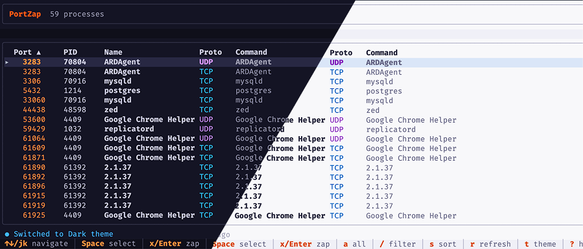

# portzap



A fast, cross-platform port management tool. Kill, list, and watch processes on network ports.

## Features

- **Kill processes**: Terminate processes running on specified ports
- **List ports**: View all listening ports or inspect specific ones
- **Watch ports**: Automatically kill any process that binds to watched ports
- **Find free ports**: Find the next available port starting from a given number
- **Wait for ports**: Block until a port becomes free or occupied
- **Shell completions**: Generate completions for bash, zsh, fish, powershell, and elvish
- **Interactive mode**: Select which processes to kill interactively
- **Cross-platform**: Works on macOS, Linux, and Windows
- **Graceful shutdown**: Sends SIGTERM first, escalates to SIGKILL if needed

## Installation

### Using Cargo (Recommended)

```bash
cargo install portzap
```

### Using npm

```bash
npm install -g portzap
```

### From source

```bash
git clone https://github.com/justinkarso/portzap
cd portzap
cargo install --path .
```

## Usage

### Kill processes on ports

```bash
# Kill process on port 3000
portzap 3000

# Kill processes on multiple ports
portzap 3000 8080 9090

# Kill processes on port range
portzap 3000-3010

# Interactive mode: choose which process to kill
portzap -i 3000

# Dry run: show what would be killed without killing
portzap --dry-run 3000
```

### List processes on ports

```bash
# List all listening ports
portzap list

# Show what's on port 3000
portzap list 3000
```

### Watch ports

```bash
# Watch port 3000 and auto-kill anything that binds to it
portzap watch 3000

# Watch multiple ports
portzap watch 3000 8080
```

### Find free ports

```bash
# Find the next free port starting from 3000
portzap free 3000

# Find free port with an upper bound
portzap free 3000 --max 4000

# JSON output (useful for scripts and agents)
portzap free 3000 --format json
```

### Wait for port state changes

```bash
# Wait until port 3000 becomes free (default)
portzap wait 3000

# Wait until port 3000 becomes occupied
portzap wait 3000 --until up

# Custom timeout (0 = infinite)
portzap wait 3000 --timeout 10

# Custom poll interval
portzap wait 3000 --poll 500
```

### Shell completions

```bash
# Generate completions for your shell
portzap completions bash
portzap completions zsh
portzap completions fish
portzap completions powershell
portzap completions elvish

# Example: add to your .bashrc
eval "$(portzap completions bash)"
```

### Interactive GUI Mode

Launch an interactive terminal UI to browse and manage processes:

```bash
# Open the GUI dashboard
portzap gui
```

The GUI provides:
- **Browse all listening ports** - View all processes using network ports with details (PID, command, protocol)
- **Search & filter** - Press `/` to filter processes by name
- **Sort** - Press `s` to cycle through sort options (port, PID, name, protocol)
- **Select & kill** - Use arrow keys to navigate, `Space`/`Enter` to toggle selection and kill processes
- **Keyboard shortcuts**:
  - `↑/↓` - Navigate
  - `Space/Enter` - Toggle selection and kill
  - `Tab` - Multi-select
  - `/` - Filter by name
  - `s` - Sort
  - `r` - Refresh
  - `?` - Show help
  - `q/Esc` - Quit

## Options

- `-i, --interactive`: Interactive mode to select processes
- `--dry-run`: Show what would be killed without actually killing
- `-s, --signal`: Signal to send (term, kill, int, hup)
- `--no-graceful`: Skip graceful shutdown, send signal immediately
- `-t, --timeout`: Timeout for graceful shutdown (default: 5 seconds)
- `--format`: Output format (table, json, plain)

## Examples

```bash
# Kill development server on port 3000
portzap 3000

# List all ports in JSON format
portzap list --format json

# Watch port 8080 with 2-second poll interval
portzap watch 8080 --poll 2000

# Kill process on port 5000 interactively
portzap -i 5000
```

## Using with AI Agents

AI coding agents (Claude Code, Cursor, Copilot, etc.) frequently need to check and kill processes on ports. Instead of parsing platform-specific `lsof` output, agents can use portzap's `--format json` for reliable, structured results.

### Agent-friendly commands

```bash
# Check what's on port 3000 (structured JSON output)
portzap list 3000 --format json

# List all listening ports
portzap list --format json

# Kill a process on port 3000 (with JSON result)
portzap 3000 --format json

# Preview what would be killed without killing
portzap --dry-run 3000 --format json

# Find the next free port starting from 3000
portzap free 3000 --format json

# Wait until a port is free before starting a server
portzap wait 3000 --timeout 10 --format json
```

### Example JSON output

```bash
$ portzap list 3000 --format json
```
```json
[
  {
    "pid": 12345,
    "name": "node",
    "port": 3000,
    "protocol": "tcp",
    "command": "node server.js"
  }
]
```

### Add to your project

Drop this into your project's `CLAUDE.md`, `.cursorrules`, or equivalent agent instructions file:

```
When you need to check or kill processes on ports, use `portzap` instead of lsof/netstat:
- Check a port: portzap list <port> --format json
- Kill a port: portzap <port> --format json
- List all ports: portzap list --format json
- Find free port: portzap free <port> --format json
- Wait for port: portzap wait <port> --timeout 10 --format json
```

## License

MIT
